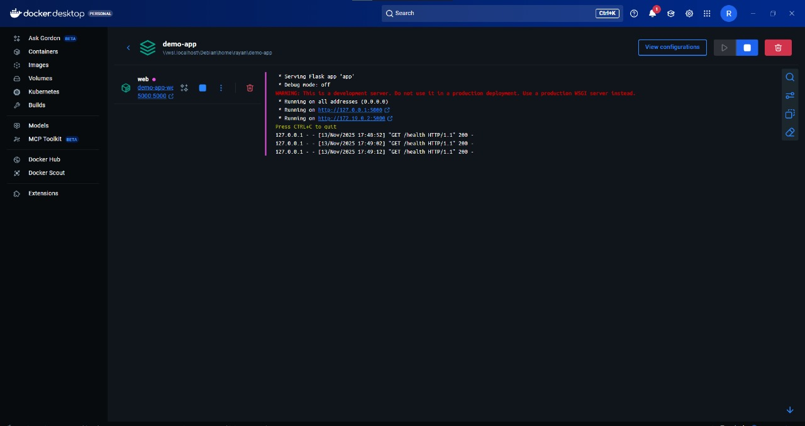
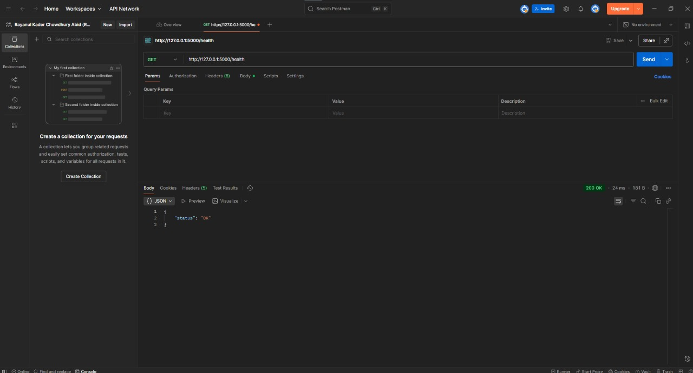
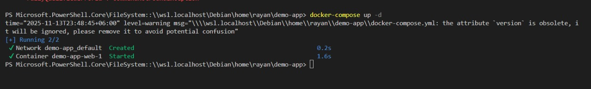

🚀 Demo Flask Application (CI/CD Example)

This repository contains a lightweight Flask-based web application designed to demonstrate a complete CI/CD workflow using Jenkins, Docker, and Docker Compose.

📁 Project Structure

Jenkinsfile – Declarative Jenkins pipeline (build → test → package → deploy → health-check)

Dockerfile – Builds the Docker image for the application

docker-compose.yml – Spins up the web service and includes a health check

app/app.py – Minimal Flask application with / and /health endpoints

healthcheck.sh – Script used to verify the /health endpoint during deployment

▶️ Running Locally

Run the app locally using Docker Compose:
cd "C:\xampp\htdocs\DEMOS\demo-app"

# Build and start the containers
docker-compose up --build -d

# Verify health endpoint
(Invoke-WebRequest -UseBasicParsing -Uri http://localhost:5000/health).Content

If you're using Docker Compose v2, simply use:
docker compose up --build -d

For Jenkins-in-Docker setup instructions, refer to the project documentation or reach out if you need guidance.

## 📸 Screenshots

### 🐳 Docker / Compose Output

### 🌐 App Response (Postman / curl)

### 💻 Shell / Console Output

